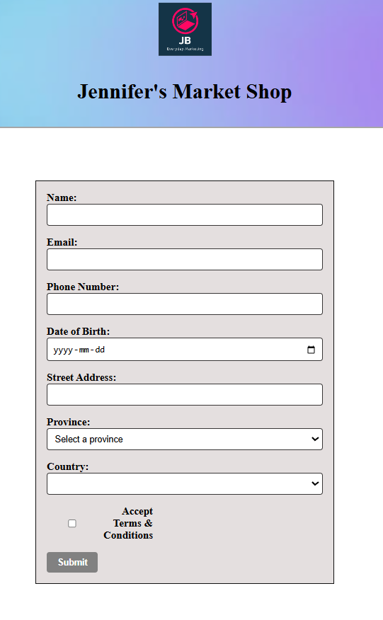

# EverydayMarketApp-v3
A front-end web application built with **Angular**, designed to simulate a clean, responsive market interface. This project demonstrates component-based architecture, routing, and form validation in a real-world layout.

This project was generated using [Angular CLI](https://github.com/angular/angular-cli) version 19.1.8.


## Features:
- Responsive layout with Angular CLI and SCSS
- Multi-page routing (Home, Products, Register)
- Reactive forms with client-side validation
- Component-based structure using Angular modules
- Deployment-ready with GitHub Actions and Azure


## Technologies Used:
- Angular
- TypeScript
- SCSS
- Angular Router
- Node.js (for local development)


  ## Folder Structure:

  📂 src/
├── 📁 app/
│   ├── 📁 components/
│   ├── 📁 services/
│   ├── app.module.ts
│   └── app-routing.module.ts
├── 📁 assets/
├── index.html
└── main.ts

  
## 🚀 Installation

```bash
# Clone the repository
git clone https://github.com/frontendjen/everyday-market-app-v3.git

# Navigate into the project folder
cd everyday-market-app-v3

# Install dependencies
npm install
```

Then visit http://localhost:4200 in your browser.


## Features
- Reactive form validation
- Dynamic dropdowns
- Responsive UI layout


## What I Learned:
- Building reusable Angular components
- Handling form validation using Reactive Forms
- Configuring routing and navigation
- Managing state and modular organization


## Screenshots:

Custom Angular form built with Reactive Forms, dropdowns, and client-side validation:



## Future Improvements:
- Product filtering and search
- Backend service/API integration
- Add cart and checkout functionality
- Better styling


## Author:
Jen Boychuk 
[GitHub: frontendjen](https://github.com/frontendjen)


## Development server

To start a local development server, run:

```bash

ng serve
```

Once the server is running, open your browser and navigate to `http://localhost:4200/`. The application will automatically reload whenever you modify any of the source files.


## Code scaffolding

Angular CLI includes powerful code scaffolding tools. To generate a new component, run:

```bash

ng generate component component-name
```

For a complete list of available schematics (such as `components`, `directives`, or `pipes`), run:

```bash
ng generate --help
```


## Building

To build the project run:

```bash
ng build
```

This will compile your project and store the build artifacts in the `dist/` directory. By default, the production build optimizes your application for performance and speed.


## Running unit tests

To execute unit tests with the [Karma](https://karma-runner.github.io) test runner, use the following command:

```bash
ng test
```


## Running end-to-end tests

For end-to-end (e2e) testing, run:

```bash
ng e2e
```

Angular CLI does not come with an end-to-end testing framework by default. You can choose one that suits your needs.

## Additional Resources

For more information on using the Angular CLI, including detailed command references, visit the [Angular CLI Overview and Command Reference](https://angular.dev/tools/cli) page.
